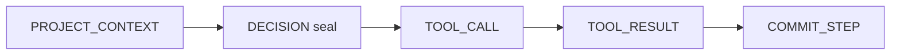

# Trajectory IR

[](https://www.bestpractices.dev/projects/14075)
[](https://github.com/Coder-s-OG-s/Trajectory-IR/actions/workflows/ci.yml)
[](LICENSE)
[](go/QUICKSTART.md)
[](QUICKSTART.md)
[](docs/MASTER_SPECIFICATION.md)

**Portable, hash-verifiable intermediate representation for agent execution trajectories.**

Trajectory IR is the **flight recorder + safety switch** for agent runs: seal the model's plan before side effects, classify tool effects, resume without re-inventing the plan, and export a runtime-independent `.tir` package anyone can verify by content hash.

It sits **on top of** durable execution engines (Temporal, DBOS, Restate). It does **not** replace them, and it is **not** another agent framework.

```text
  Agent host / framework          (LangGraph, custom loops, MCP hosts, ...)
            │
            ▼
  ┌─────────────────────────────┐
  │       Trajectory IR         │  seals · effect classes · .tir · sandbox
  └─────────────────────────────┘
            │
            ▼
  Durable backend                 (Temporal · DBOS · Restate)
```

---

## Why it exists

Production agent stacks keep failing the same way:

| Failure | What happens today | What Trajectory IR adds |
|---|---|---|
| **Crash mid-tool** | Retry re-fires a non-idempotent write (double charge, double deploy) | Block-and-gate + durable backend memoization |
| **Naive resume** | Host re-asks the model; the new plan diverges silently | Sealed `DECISION` is the plan; resume replays it |
| **Locked history** | Checkpoints trapped in one framework | Portable thin/fat `.tir` with hash-checked node IDs |
| **Unsafe demos** | A demo can email, charge, or deploy for real | Sandbox mode rejects dangerous effect classes before the tool body |

**One-line pitch:** portable semantics for *what the agent actually did*, on top of engines that already solve crash safety.

> Full normative contract: **[docs/MASTER_SPECIFICATION.md](docs/MASTER_SPECIFICATION.md)** (`spec-v0.2-draft`).  
> Short scope card: **[docs/SCOPE_AND_NON_GOALS.md](docs/SCOPE_AND_NON_GOALS.md)**.

---

## Features

- **Sealed decisions** — freeze the plan (`DECISION`) before world-changing tools run
- **Effect classes** — fail-closed classification aligned with MCP tool hints, plus `AGENT_SPAWN` and `SENSITIVE`
- **Honest resume** — sealed steps replay; they do not re-infer (conformance R01)
- **Block-and-gate** — non-idempotent tools do not double-execute after interruption (R02)
- **`.tir` packages** — thin or fat export/import with content-addressed identity; optional `trajir-pkg-sig-v1` signatures
- **Sandbox mode** — block unsafe effect classes for demos, CI, and student labs
- **Dual SDK** — **Go primary** (Temporal production backend), **Python reference** (DBOS local profile)
- **Conformance suite** — R01–R11 runnable across languages
- **OpenSSF Best Practices** — project badge and continuous hardening

---

## Quick start (Go — recommended)

**Prerequisites:** Go 1.25.x, Git

```bash
git clone https://github.com/Coder-s-OG-s/Trajectory-IR.git
cd Trajectory-IR/go
go test ./...
```

Minimal client step:

```go
tr, err := client.OpenTrajectory("demo", "qs-1", client.Options{WorkDir: dir})
// ...
tr.Project(1, map[string]any{"goal": "hello"})
tr.SealDecision(1, map[string]any{
    "tool_calls": []any{
        map[string]any{"name": "echo", "args": map[string]any{"msg": "hi"}},
    },
})
res, err := tr.ExecTool(1, 2, tool, map[string]any{"msg": "hi"})
fmt.Println(res.Result) // hi
tr.CommitStep(1, 4)
```

Full walkthrough, Temporal notes, and demos: **[go/QUICKSTART.md](go/QUICKSTART.md)**

### Python reference port (optional)

```bash
cd Trajectory-IR
python -m venv .venv
# Windows: .\.venv\Scripts\activate
# Unix:    source .venv/bin/activate
pip install -U pip
pip install -e ".[dev]"
pytest conformance/ -q
```

More: **[QUICKSTART.md](QUICKSTART.md)** · kill-mid-deploy demo: [`examples/kill_mid_deploy/`](examples/kill_mid_deploy/)

---

## Who is this for?

| Audience | Start here |
|---|---|
| **Students / newcomers** | This README → [go/QUICKSTART.md](go/QUICKSTART.md) → try sandbox + kill-mid-deploy demos |
| **Agent / platform engineers** | [docs/SCOPE_AND_NON_GOALS.md](docs/SCOPE_AND_NON_GOALS.md) → [docs/INTEGRATIONS.md](docs/INTEGRATIONS.md) → wire seals into your host loop |
| **Security / compliance** | Seals + `.tir` + sandbox; report issues via [SECURITY.md](SECURITY.md) |
| **Contributors** | [CONTRIBUTING.md](CONTRIBUTING.md) (DCO required) → Phase 1B/1C: **Go first** |
| **AI coding agents** | [docs/MASTER_SPECIFICATION.md](docs/MASTER_SPECIFICATION.md) + [AI_POLICY.md](AI_POLICY.md) — implement the spec, do not invent behavior |
| **Talks / demos** | [website/](website/README.md) MkDocs site and speaker runbook |

---

## How a run looks



1. Host projects context for the step  
2. Model plan is **sealed** before tools with side effects  
3. Tools execute under an effect class (fail closed if unknown)  
4. Step commits; trajectory can be exported as `.tir`

Same agent, two modes: **live** does the job; **sandbox** stops dangerous writes and still keeps the sealed plan.

---

## What this is / is not

| Trajectory IR **is** | Trajectory IR **is not** |
|---|---|
| A portable IR + package format for agent trajectories | A replacement for Temporal / DBOS / Restate |
| Seals, effect classes, resume *semantics*, `.tir` | An agent orchestration framework (not LangGraph) |
| A thin layer over pluggable durable backends | A long-term memory / recall product (not Mem0/Zep) |
| Open source libraries (Apache-2.0) | A hosted multi-tenant SaaS control plane |

---

## Project status

| Item | Status |
|---|---|
| Spec | `spec-v0.2-draft` — [master specification](docs/MASTER_SPECIFICATION.md) |
| Phase | **1C harden and adopt** (Go primary; Python parity) — see [docs/ROADMAP.md](docs/ROADMAP.md) |
| OpenSSF Best Practices | [Project 14075](https://www.bestpractices.dev/projects/14075) |
| CNCF Sandbox | Preparing — [outline](docs/CNCF_SANDBOX_APPLICATION_OUTLINE.md). **Not** claiming CNCF membership until TOC approval |
| Adopters | Honest empty list — [ADOPTERS.md](ADOPTERS.md) (add yourself via PR when you consent) |

---

## Documentation map

| Doc | Purpose |
|---|---|
| [docs/MASTER_SPECIFICATION.md](docs/MASTER_SPECIFICATION.md) | **Normative** architecture, data model, protocols |
| [go/QUICKSTART.md](go/QUICKSTART.md) | Fastest path to a working Go client |
| [QUICKSTART.md](QUICKSTART.md) | Repo-wide quickstart (Go + Python) |
| [docs/SCOPE_AND_NON_GOALS.md](docs/SCOPE_AND_NON_GOALS.md) | In / out of scope |
| [docs/ROADMAP.md](docs/ROADMAP.md) | Public roadmap |
| [docs/INTEGRATIONS.md](docs/INTEGRATIONS.md) | Host and backend integration notes |
| [docs/RELEASE.md](docs/RELEASE.md) | Release process |
| [website/README.md](website/README.md) | Demo / docs site (MkDocs) |
| [CHANGELOG.md](CHANGELOG.md) | What shipped |

---

## Contributing

We welcome students, first-time OSS contributors, and experienced systems engineers.

1. Read **[CONTRIBUTING.md](CONTRIBUTING.md)** — every commit needs `Signed-off-by` (DCO)
2. Follow **[CODE_OF_CONDUCT.md](CODE_OF_CONDUCT.md)**
3. Prefer **Go** for new Phase 1B/1C features (`go/trajir`); keep Python green for parity
4. Do **not** reimplement durable execution (retry / lease / crash engines) — adapters only
5. Spec questions → open a **Spec question** issue; do not invent undefined behavior

```bash
git commit -s -m "feat: short description"
```

Governance: [GOVERNANCE.md](GOVERNANCE.md) · Maintainers: [MAINTAINERS.md](MAINTAINERS.md) · AI-assisted work: [AI_POLICY.md](AI_POLICY.md)

### Good first directions

- Improve docs and quickstarts for newcomers
- Add or harden conformance / unit tests
- Fix sandbox, redaction, or packaging edge cases
- Dual-language parity when an issue asks for it
- Real adopter stories in [ADOPTERS.md](ADOPTERS.md) (with consent only)

---

## Security

Please report vulnerabilities privately per **[SECURITY.md](SECURITY.md)**.  
Do not open public issues for undisclosed security bugs.

---

## License

Apache License 2.0 — see [LICENSE](LICENSE).  
Third-party notices: [docs/THIRD_PARTY_LICENSES.md](docs/THIRD_PARTY_LICENSES.md)

---

## Acknowledgments

Trajectory IR builds on ideas and prior art from durable execution (Temporal, DBOS, Restate), MCP tool annotations, and the CNCF TAG Infrastructure discussion of agentic AI storage needs. See §3.1 and §18 of the [master specification](docs/MASTER_SPECIFICATION.md).

---

*Questions? Open a GitHub Discussion or Issue. Spec wins over chat — when in doubt, read [docs/MASTER_SPECIFICATION.md](docs/MASTER_SPECIFICATION.md).*
