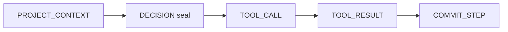

# Trajectory IR

[](https://www.bestpractices.dev/projects/14075)
[](https://github.com/Coder-s-OG-s/Trajectory-IR/actions/workflows/ci.yml)
[](LICENSE)
[](go/QUICKSTART.md)
[](QUICKSTART.md)
[](docs/MASTER_SPECIFICATION.md)

**Portable, hash-verifiable intermediate representation for agent execution trajectories.**

A **flight recorder** for agent runs: typed nodes, a sealed model plan, fail-closed effect classes, and a runtime-independent `.tir` package anyone can verify by content hash.

It sits **on top of** durable execution engines (Temporal, DBOS, Restate). It does **not** replace them, and it is **not** another agent framework. It does **not** freeze AWS, auctions, or users while you are crashed, and a client-side gate is **not** exactly-once at Stripe.

```text
  Agent host / framework          (LangGraph, custom loops, MCP hosts, ...)
            │
            ▼
  ┌─────────────────────────────┐
  │       Trajectory IR         │  seals · effect classes · .tir · sandbox
  └─────────────────────────────┘
            │
            ▼
  Durable backend                 (Temporal · DBOS · Restate)
```

---

## Why it exists

Production agent stacks keep failing the same way. Crash replay is already Temporal/DBOS/Restate's job. The hole they do not fill is a **portable, hash-verifiable record of what the agent actually decided and invoked**, plus agent-shaped policy on top of that record.

| Failure | Who actually solves it | What Trajectory IR adds |
|---|---|---|
| **Crash mid-tool** | Durable backend memoization. **Exactly-once** still needs a server-side idempotency key the remote API honors. | Block-and-gate: at most one automatic attempt from this client. Unknown in-flight calls go to `BLOCKED_NEEDS_GATE` for a human, not a second LLM turn. The seal-derived key is recorded on `TOOL_CALL` so you can *forward* it. |
| **Naive resume** | Do not re-call the model for a sealed step (backend replay + IR seal). | Honest resume of the sealed plan (R01). That freezes **the plan**, not **the world**. If the cluster changed while you were dead, re-observe (`READ_ONLY`) or abort and start a **new** step. Hosts that declared a `WORLD_SNAPSHOT` at seal time can `CheckWorld` and get fail-loud `WORLD_DRIFT`. Do not silently re-infer the sealed one. |
| **Locked history** | Nobody else ships a runtime-independent unit. | Portable thin/fat `.tir` with hash-checked node IDs |
| **Unsafe demos** | Host policy. | Sandbox mode is a **demo/CI effect-class gate** before the tool body (R06). It is not a process sandbox, not an AST of `bash`, and not a security boundary for arbitrary code. |

**One-line pitch:** portable semantics for *what the agent actually did*, on top of engines that already solve crash safety.

### What "IR" means here

This is a **runtime trajectory IR**, not LLVM. You do not compile a prompt into `.tir` ahead of time. Hosts **lower** a live agent step into typed, content-addressed nodes; you can project, redact, graft, verify, and export that trace onto more than one backend. If you wanted a compiler, this is the wrong repo. If you wanted a vendor-neutral flight recorder for agent steps, this is the product.

> Full normative contract: **[docs/MASTER_SPECIFICATION.md](docs/MASTER_SPECIFICATION.md)** (`spec-v0.2-draft`).  
> Short scope card: **[docs/SCOPE_AND_NON_GOALS.md](docs/SCOPE_AND_NON_GOALS.md)**.

---

## Features

- **Sealed decisions** — freeze the model's plan (`DECISION`) before world-changing tools run. The world is not frozen with it.
- **Effect classes** — fail-closed mapping from MCP tool hints, plus `AGENT_SPAWN` and `SENSITIVE`. Open-world primitives (`bash`, `python`, `sql`, browser) stay `NON_IDEMPOTENT_WRITE` unless an operator sets the class on the tool. No command parser.
- **Honest resume** — a sealed step does not re-infer (R01). Re-observe is allowed; re-plan is a **new** step. Optional `WORLD_SNAPSHOT` + `CheckWorld` is fail-loud when the host declared what it depends on.
- **Block-and-gate** — non-idempotent tools are not blindly retried after interruption (R02). At-most-one automatic attempt, not exactly-once in the world.
- **Seal-derived idempotency keys** — length-prefixed `sha256` of domain, tenant, trajectory, step, and seq on every `TOOL_CALL`, exposed to the tool body as CallMeta so you can send `Idempotency-Key`. Never stuffed into Python kwargs. Hosts must forward that string to the remote API. The withdrawn colon key does not resume onto this hash.
- **`.tir` packages** — thin or fat export/import with content-addressed identity; optional `trajir-pkg-sig-v1` signatures
- **Sandbox mode** — demo/CI gate that rejects dangerous effect classes before the tool body. Not a security sandbox.
- **Dual SDK** — **Go primary** (Temporal production backend), **Python reference** (DBOS local profile)
- **Conformance suite** — R01–R11 runnable across languages
- **OpenSSF Best Practices** — project badge and continuous hardening

---

## Quick start (Go — recommended)

**Prerequisites:** Go 1.26.9, Git

```bash
git clone https://github.com/Coder-s-OG-s/Trajectory-IR.git
cd Trajectory-IR/go
go test ./...
```

Minimal client step:

```go
tr, err := client.OpenTrajectory("demo", "qs-1", client.Options{WorkDir: dir})
// ...
tr.Project(1, map[string]any{"goal": "hello"})
tr.SealDecision(1, map[string]any{
    "tool_calls": []any{
        map[string]any{"name": "echo", "args": map[string]any{"msg": "hi"}},
    },
})
res, err := tr.ExecTool(1, 2, tool, map[string]any{"msg": "hi"})
fmt.Println(res.Result) // hi
tr.CommitStep(1, 4)
```

Full walkthrough, Temporal notes, and demos: **[go/QUICKSTART.md](go/QUICKSTART.md)**

### Python reference port (optional)

```bash
cd Trajectory-IR
python -m venv .venv
# Windows: .\.venv\Scripts\activate
# Unix:    source .venv/bin/activate
pip install -U pip
pip install -e ".[dev]"
pytest conformance/ -q
```

More: **[QUICKSTART.md](QUICKSTART.md)** · kill-mid-deploy demo: [`examples/kill_mid_deploy/`](examples/kill_mid_deploy/)

---

## Who is this for?

| Audience | Start here |
|---|---|
| **Students / newcomers** | This README → [go/QUICKSTART.md](go/QUICKSTART.md) → try sandbox + kill-mid-deploy demos |
| **Agent / platform engineers** | [docs/SCOPE_AND_NON_GOALS.md](docs/SCOPE_AND_NON_GOALS.md) → [docs/INTEGRATIONS.md](docs/INTEGRATIONS.md) → wire seals into your host loop |
| **Security / compliance** | Seals + `.tir` (hash-verifiable export); report issues via [SECURITY.md](SECURITY.md). Sandbox is a demo gate, not a security boundary. |
| **Contributors** | [CONTRIBUTING.md](CONTRIBUTING.md) (DCO required) → Phase 1B/1C: **Go first** |
| **AI coding agents** | [docs/MASTER_SPECIFICATION.md](docs/MASTER_SPECIFICATION.md) + [AI_POLICY.md](AI_POLICY.md) — implement the spec, do not invent behavior |
| **Talks / demos** | [website/](website/README.md) MkDocs site and speaker runbook |

---

## How a run looks


```mermaid
flowchart LR
  A[PROJECT_CONTEXT] --> B[DECISION seal]
  B --> C[TOOL_CALL]
  C --> D[TOOL_RESULT]
  D --> E[COMMIT_STEP]
```

1. Host projects context for the step  
2. Model plan is **sealed** before tools with side effects  
3. Tools execute under an effect class (fail closed if unknown)  
4. Step commits; trajectory can be exported as `.tir`

Same agent, two modes: **live** does the job; **sandbox** refuses dangerous *classified* effects and still keeps the sealed plan. Tag `bash` as read-only and `ExecTool` will refuse unless you set `AllowOpenWorldOverride` and own that lie.

---

## What this is / is not

| Trajectory IR **is** | Trajectory IR **is not** |
|---|---|
| A portable runtime IR + `.tir` package for agent trajectories | LLVM, bytecode, or a compiler for prompts |
| Seals, effect classes, resume *semantics*, hash-verifiable export | A replacement for Temporal / DBOS / Restate (adapters only) |
| A thin layer over pluggable durable backends | An agent orchestration framework (not LangGraph) |
| At-most-one automatic retry policy + a key you can forward | Exactly-once remote writes (that is the *server's* idempotency key) |
| A demo/CI effect-class gate (R06) | A process sandbox or `bash` AST analyzer |
| Open source libraries (Apache-2.0) | A hosted multi-tenant SaaS control plane, or a long-term memory product |

---

## Project status

| Item | Status |
|---|---|
| Spec | `spec-v0.2-draft` — [master specification](docs/MASTER_SPECIFICATION.md) |
| Phase | **1C harden and adopt** (Go primary; Python parity) — see [docs/ROADMAP.md](docs/ROADMAP.md) |
| OpenSSF Best Practices | [Project 14075](https://www.bestpractices.dev/projects/14075) |
| CNCF Sandbox | Preparing — [outline](docs/CNCF_SANDBOX_APPLICATION_OUTLINE.md). **Not** claiming CNCF membership until TOC approval |
| Adopters | Honest empty list — [ADOPTERS.md](ADOPTERS.md) (add yourself via PR when you consent) |

---

## Documentation map

| Doc | Purpose |
|---|---|
| [docs/MASTER_SPECIFICATION.md](docs/MASTER_SPECIFICATION.md) | **Normative** architecture, data model, protocols |
| [go/QUICKSTART.md](go/QUICKSTART.md) | Fastest path to a working Go client |
| [QUICKSTART.md](QUICKSTART.md) | Repo-wide quickstart (Go + Python) |
| [docs/SCOPE_AND_NON_GOALS.md](docs/SCOPE_AND_NON_GOALS.md) | In / out of scope |
| [docs/ROADMAP.md](docs/ROADMAP.md) | Public roadmap |
| [docs/INTEGRATIONS.md](docs/INTEGRATIONS.md) | Host and backend integration notes |
| [docs/RELEASE.md](docs/RELEASE.md) | Release process |
| [website/README.md](website/README.md) | Demo / docs site (MkDocs) |
| [CHANGELOG.md](CHANGELOG.md) | What shipped |

---

## Contributing

We welcome students, first-time OSS contributors, and experienced systems engineers.

1. Read **[CONTRIBUTING.md](CONTRIBUTING.md)** — every commit needs `Signed-off-by` (DCO)
2. Follow **[CODE_OF_CONDUCT.md](CODE_OF_CONDUCT.md)**
3. Prefer **Go** for new Phase 1B/1C features (`go/trajir`); keep Python green for parity
4. Do **not** reimplement durable execution (retry / lease / crash engines) — adapters only
5. Spec questions → open a **Spec question** issue; do not invent undefined behavior

```bash
git commit -s -m "feat: short description"
```

Governance: [GOVERNANCE.md](GOVERNANCE.md) · Maintainers: [MAINTAINERS.md](MAINTAINERS.md) · AI-assisted work: [AI_POLICY.md](AI_POLICY.md)

### Good first directions

- Improve docs and quickstarts for newcomers
- Add or harden conformance / unit tests
- Fix sandbox, redaction, or packaging edge cases
- Dual-language parity when an issue asks for it
- Real adopter stories in [ADOPTERS.md](ADOPTERS.md) (with consent only)

---

## Security

Please report vulnerabilities privately per **[SECURITY.md](SECURITY.md)**.  
Do not open public issues for undisclosed security bugs.

---

## License

Apache License 2.0 — see [LICENSE](LICENSE).  
Third-party notices: [docs/THIRD_PARTY_LICENSES.md](docs/THIRD_PARTY_LICENSES.md)

---

## Acknowledgments

Trajectory IR builds on ideas and prior art from durable execution (Temporal, DBOS, Restate), MCP tool annotations, and the CNCF TAG Infrastructure discussion of agentic AI storage needs. See §3.1 and §18 of the [master specification](docs/MASTER_SPECIFICATION.md).

---

*Questions? Open a GitHub Discussion or Issue. Spec wins over chat — when in doubt, read [docs/MASTER_SPECIFICATION.md](docs/MASTER_SPECIFICATION.md).*
