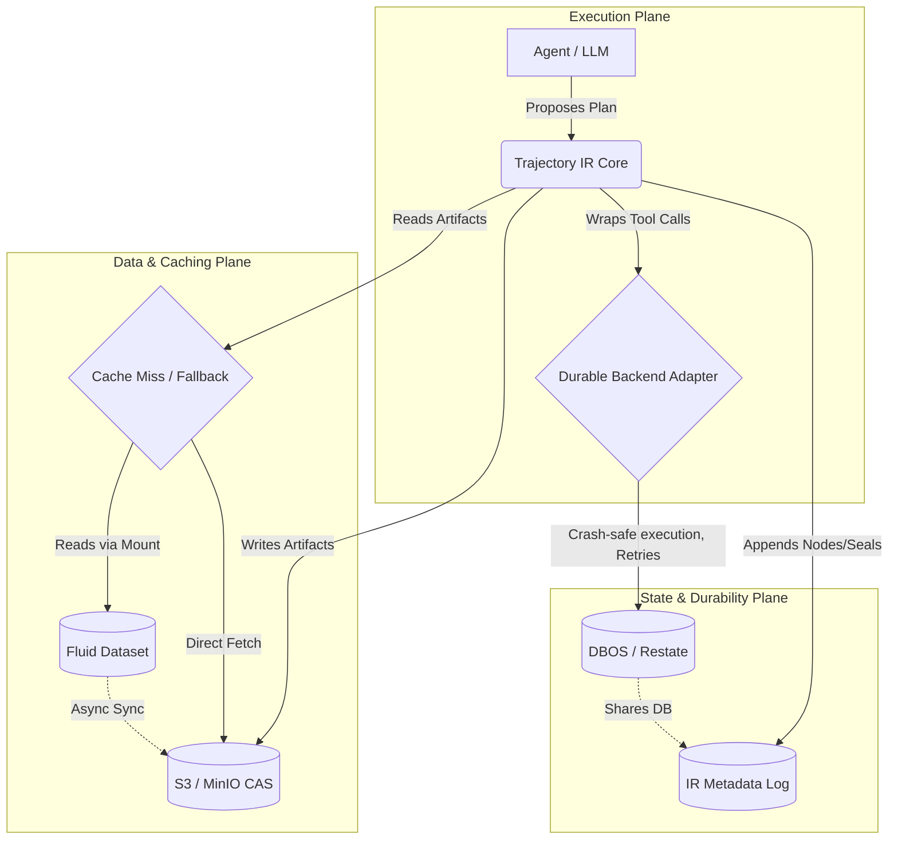
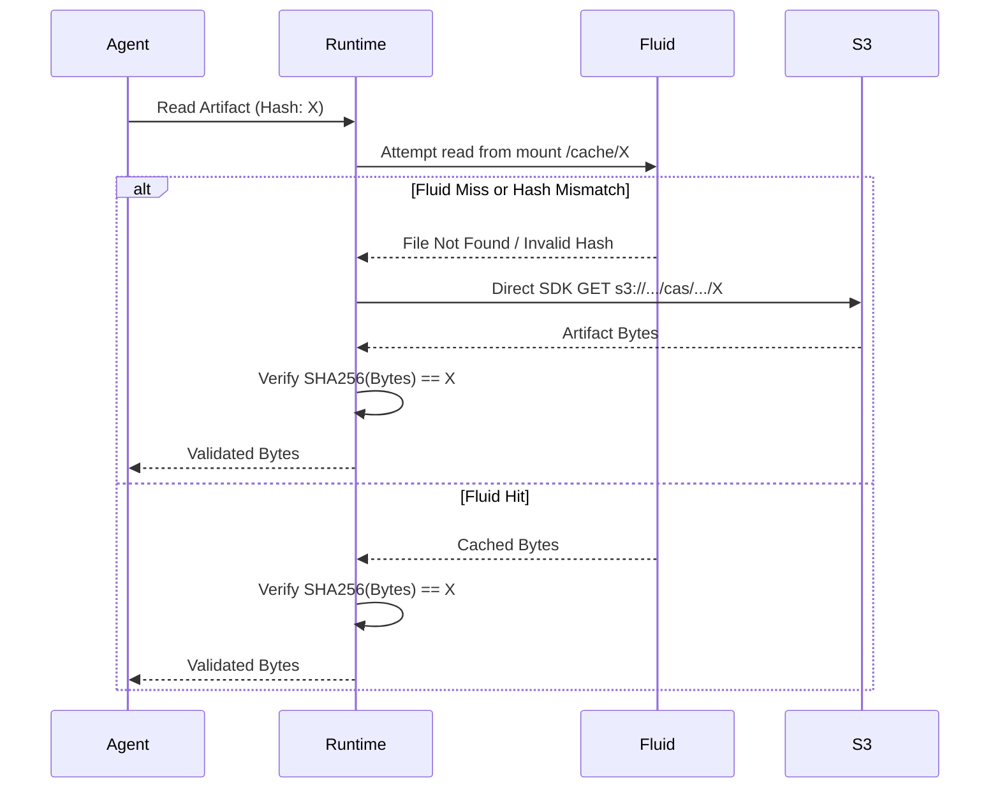

# Trajectory IR Infrastructure & Deployment Design

This document provides a highly defined, technical blueprint for the infrastructure supporting Trajectory IR. It maps the specifications from the master `README.md` into concrete data flows, storage schemas, and deployment topologies.

## 1. System Architecture & Component Interaction

Trajectory IR operates as a semantic layer over existing execution and storage primitives. The system is cleanly divided into three operational planes:



### Component Breakdown
1. **Durable Backend Adapter**: Isolates Trajectory IR from the specifics of Temporal/Restate/DBOS. It intercepts `DECISION` and `TOOL_CALL` nodes and runs them as native durable steps, acquiring lease/heartbeat protection automatically.
2. **IR Metadata Log**: The relational store (SQLite/Postgres) containing the append-only `nodes`, immutable `seals`, and `trajectory` state.
3. **CAS (Content Addressed Storage)**: The S3-compatible blob store for arbitrary artifact bytes.
4. **Fluid Dataset (Optional)**: A Kubernetes-native read-path accelerator (using Alluxio/JuiceFS) for massive read-heavy corpora.

---

## 2. Storage Mechanics & Data Layouts

### 2.1 The Relational IR Log
Trajectory metadata is stored relationally. Whether using SQLite (local) or PostgreSQL (server), the schema remains identical:

- `trajectories`: `trajectory_id` (PK), `tenant_id`, `status`.
- `nodes`: `node_id` (PK, computed via RFC 8785 JCS + SHA256), `trajectory_id`, `seq`, `kind`, `payload`.
- `seals`: `seal_id` (PK), `node_id` (FK), `signature`.

> [!TIP]
> **Co-location with DBOS**: In Phase 1A, DBOS workflow state tables and Trajectory IR tables live in the *same* database instance (SQLite file or Postgres schema), eliminating distributed transaction overhead.

### 2.2 Sharded CAS Object Store
Artifacts are never stored using a flat prefix. To prevent S3 bucket listing degradation and Fluid metadata sync bottlenecks, objects are sharded by the first two hex characters of their SHA256 hash.

```text
s3://<bucket_name>/cas/<shard_prefix>/<full_hash>

# Example for hash: e3b0c44298fc1c149afbf4c8996fb92427ae41e4649b934ca495991b7852b855
s3://trajir/cas/e3/b0c44298fc1c149afbf4c8996fb92427ae41e4649b934ca495991b7852b855
```

### 2.3 The Read-Path & Cache Fallback Data Flow
Trajectory IR strictly enforces that **correctness never depends on a cache**. 



---

## 3. Deployment Profiles

The infrastructure is defined by three progressively scaling profiles. Code never forks; only configuration changes.

### Step 1: `local` Profile (Phase 1A Target)
The frictionless developer environment.
* **Execution**: Embedded DBOS library inside the Python process.
* **Database**: Local SQLite file (`~/.trajectory-ir/local.db`).
* **Storage**: Local filesystem mapping the sharded CAS layout (`~/.trajectory-ir/cas/`).
* **Networking**: None. Fully offline capable.

### Step 2: `server-s3` Profile (Single-Region API)
The standard production topology for standalone APIs.
* **Execution**: Standalone API server container (`Dockerfile.server`).
* **Database**: Amazon RDS for PostgreSQL (or equivalent).
* **Storage**: Amazon S3 (using `boto3` or S3 API compliant SDK).
* **High Availability**: Stateless API pods can scale horizontally, relying on Postgres locks and DBOS leases for concurrency control.

### Step 3: `k8s-fluid` Profile (Multi-Pod Agent Fleets)
The enterprise scale Kubernetes topology for massive read-fanout (e.g., hundreds of agents reading the same 50GB code repository snapshot).
* **Execution**: Kubernetes Deployments managed via Helm (`charts/trajectory-ir/`).
* **Database**: Managed PostgreSQL.
* **Storage**: Amazon S3.
* **Caching**: 
  - Fluid `Dataset` Custom Resource deployed via Helm.
  - Fluid `Runtime` (Alluxio/JuiceFS) provisions worker pods to cache data.
  - Trajectory API pods mount the Fluid cache via FUSE CSI driver.
* **Multi-Tenancy**: Tenants share a single Fluid Dataset, isolated purely by path prefixes, avoiding the overhead of one cache cluster per tenant.

---

## 4. Phase 1A Implementation Requirements

To fulfill this design in Phase 1A, the following technology stack is mandated:

1. **Python 3.11+**: Primary runtime.
2. **`canonicaljson`**: For strict, cross-language stable RFC 8785 JCS hashing.
3. **`dbos-transact`**: Python library for the embedded durable execution backend.
4. **`pytest` & `pytest-cov`**: Enforcing >80% test coverage and R01/R02 conformance gates.
